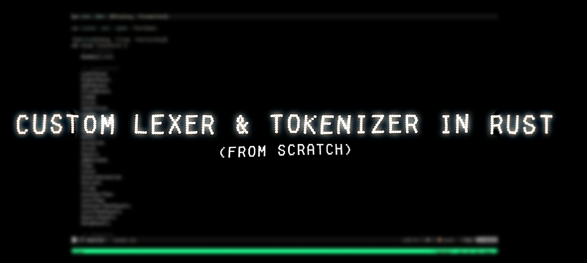

# Custom Lexer & Tokenizer in Rust (From Scratch)

[]([https://youtu.be/1eVuMJeRuXU](https://youtu.be/d2YCP1T26lQ))

This project marks the first milestone in my journey toward **compiler construction**. A lexer and tokenizer form the foundation of any programming language implementation, transforming raw source code into structured tokens that can later be parsed, analyzed, and executed. By implementing this in Rust, I aimed to achieve both high performance and strong safety guarantees, while also deepening my understanding of compiler front-end design.

---

## ✨ Highlights

* Tokenizing keywords, identifiers, literals, and operators
* Handling whitespace and unexpected inputs gracefully
* Modular design for easy extension and scalability
* Clean Rust code balancing clarity, safety, and efficiency

---

## 🌱 Future Plans

This project is only the starting point. Next, I will be working on:

* Parsers for building abstract syntax trees (ASTs)
* Type checking and semantic analysis
* Developing a fully custom compiler in Rust
* Extending this lexer into a syntax highlighting engine for code editors

---

## 🛠️ Built With

* Rust
* Core systems programming principles
* Compiler front-end architecture concepts

---

## 📂 Repository Structure

```
├── src
│   ├── lexer.rs     # Lexer implementation
│   ├── token.rs     # Token definitions
│   └── main.rs      # Example usage and entry point
├── Cargo.toml       # Rust project configuration
└── README.md        # Project documentation
```

---

## 🚀 Getting Started

### Prerequisites

* Install [Rust](https://www.rust-lang.org/tools/install)

### Build & Run

```bash
git clone https://github.com/yourusername/rust-lexer.git
cd rust-lexer
cargo run
```

---

## 📖 Example

Input code:

```rust
let x = 10 + 20;
```

Output tokens:

```
Keyword(let)
Identifier(x)
Operator(=)
Literal(10)
Operator(+)
Literal(20)
Separator(;)
```

---

## 🤝 Contributing

Contributions, issues, and feature requests are welcome! Feel free to open an issue or submit a pull request.

---

## 📜 License

This project is licensed under the MIT License. See [LICENSE](LICENSE) for details.
